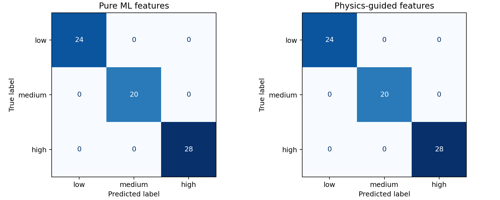
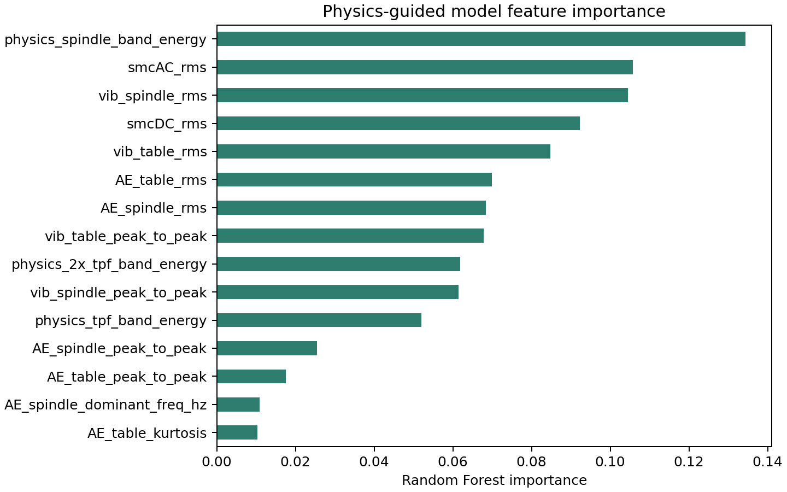
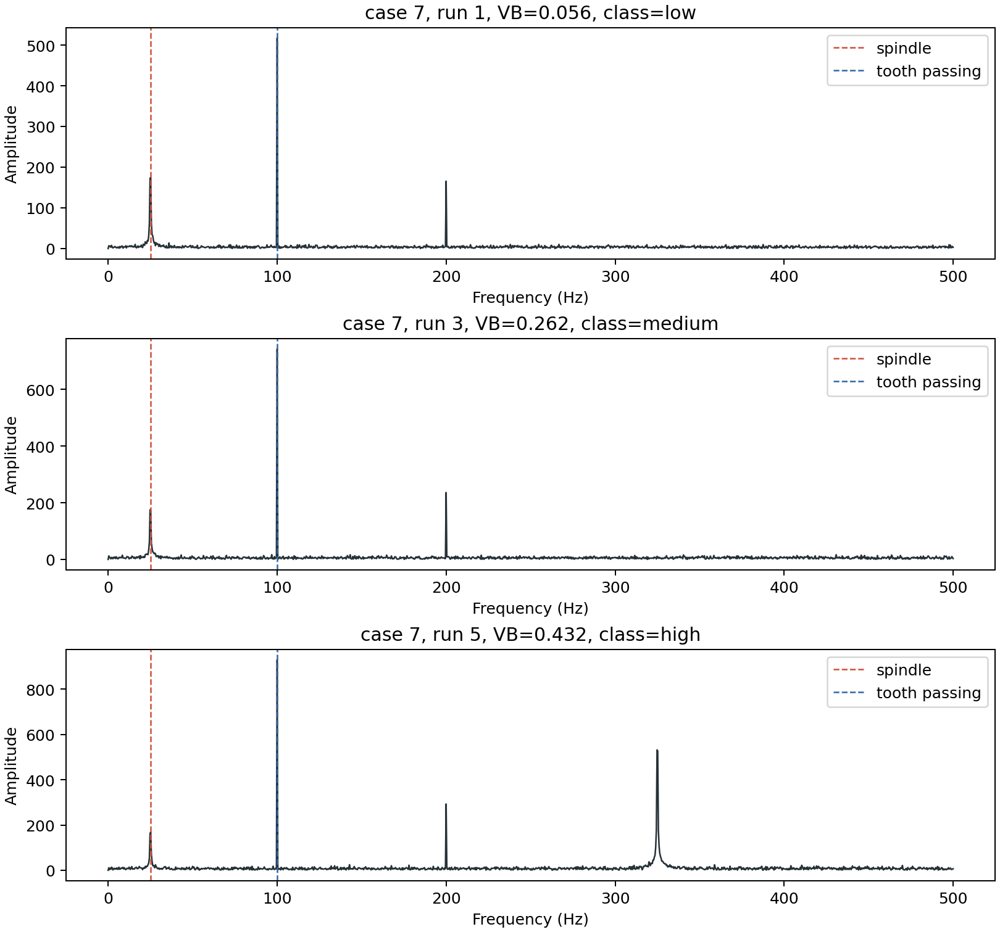
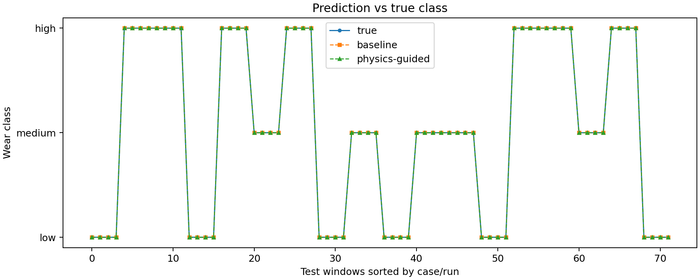

# Physics-Guided ML for Milling Vibration and Tool Wear Detection

This is a compact first version of a milling tool-wear detection project. It loads milling sensor runs, splits signals into time windows, extracts ordinary signal features, adds simple physics-guided features around spindle and tooth-passing frequencies, then compares both feature sets with a Random Forest classifier.

The loader supports:

- NASA Milling Wear MATLAB data (`mill.mat` inside the NASA ZIP or an extracted `.mat` file)
- CSV files with either one row per sample or one row per run
- A built-in synthetic demo dataset for quick smoke tests

Public dataset reference: NASA PCoE Milling Wear, "Experiments on a milling machine for different speeds, feeds, and depth of cut. Records the wear of the milling insert, VB." Download links are listed in the NASA PCoE data repository and NASA Open Data portal.

## Project Layout

```text
machining-vibration-ml/
├── README.md
├── data_loader.py
├── feature_extraction.py
├── physics_features.py
├── train_baseline.py
├── train_physics_guided.py
├── evaluate.py
├── app/
│   └── main.py
├── notebooks/
│   └── signal_analysis.ipynb
├── results/
│   ├── confusion_matrix.png
│   ├── feature_importance.png
│   ├── fft_examples.png
│   └── prediction_vs_true.png
└── requirements.txt
```

## Setup

```bash
python -m venv .venv
.venv\Scripts\activate
pip install -r requirements.txt
```

## Run the Demo

The demo generates synthetic milling-like vibration signals with spindle, tooth-passing, noise, and wear-related chatter components.

```bash
python evaluate.py --demo
```

This trains both models and writes plots and metrics to `results/`.

## Result Screenshots

These screenshots were generated by running:

```bash
python evaluate.py --demo
```

The demo data is synthetic, so the numbers are a smoke test for the pipeline rather than a claim of production accuracy on NASA data.

### Confusion Matrix



### Feature Importance



### FFT Examples



### Prediction vs True



## What This Demonstrates

- Loads milling runs from MATLAB, ZIP, CSV, or the built-in demo generator.
- Splits sensor signals into overlapping time windows.
- Extracts classic vibration features: RMS, peak-to-peak, kurtosis, skewness, dominant frequency, and spectral centroid.
- Adds physics-guided frequency features around spindle speed and tooth-passing frequency.
- Trains two comparable Random Forest classifiers using the same train/test split:
  - pure ML signal features
  - pure ML plus physics-guided features
- Saves trained models, metrics, predictions, and plots for quick inspection.

## Limitations and Next Steps

- The included results are from synthetic demo data. Replace `--demo` with `--data-path path\to\mill.zip` or a prepared CSV/MAT file for real experiments.
- Wear classes use simple VB thresholds: low `< 0.20`, medium `< 0.40`, high `>= 0.40`. These should be adjusted for the chosen insert, material, and process limits.
- The loader handles common NASA-style fields, but public milling datasets vary. Real projects should validate channel names, sampling rates, spindle speed metadata, and run labels before trusting metrics.
- The physics features are intentionally small. Useful next features include chatter-band tracking, order-domain features, harmonics around tooth-passing frequency, force/torque features, and uncertainty estimates.
- The model is a compact Random Forest baseline. A later version could add a small 1D CNN or temporal model once the data split and labels are settled.

## Use NASA Milling Wear Data

Download the NASA Milling Wear ZIP, then either point to the ZIP or extract it:

```bash
python evaluate.py --data-path path\to\mill.zip
python evaluate.py --data-path path\to\mill.mat
```

If the dataset version does not include spindle speed per run, place a CSV with columns such as `case`, `run`, `speed_rpm`, and `tooth_count` next to your data, or include those columns in a converted CSV. Without speed metadata the baseline still works, and physics band features fall back to zeros for the missing frequency bands.

## Train Individual Models

```bash
python train_baseline.py --demo
python train_physics_guided.py --demo
```

Both scripts save a `.joblib` model and a metrics JSON file under `results/`.

## Features

Pure ML features per signal channel:

- RMS
- peak-to-peak amplitude
- kurtosis
- skewness
- dominant frequency
- spectral centroid

Physics-guided features:

- spindle frequency
- tooth-passing frequency
- normalized band energy around spindle frequency
- normalized band energy around tooth-passing frequency
- normalized band energy around second tooth-passing harmonic
- dominant-frequency ratios relative to spindle and tooth-passing frequencies

## Optional API

Train the physics-guided model first:

```bash
python evaluate.py --demo
uvicorn app.main:app --reload
```

Then post a single window:

```json
{
  "sample_rate_hz": 2000,
  "speed_rpm": 1200,
  "feed": 0.08,
  "depth_of_cut": 1.0,
  "tooth_count": 4,
  "vib_spindle": [0.1, 0.2, 0.1, -0.1]
}
```

The API returns the predicted wear class and class probabilities.
